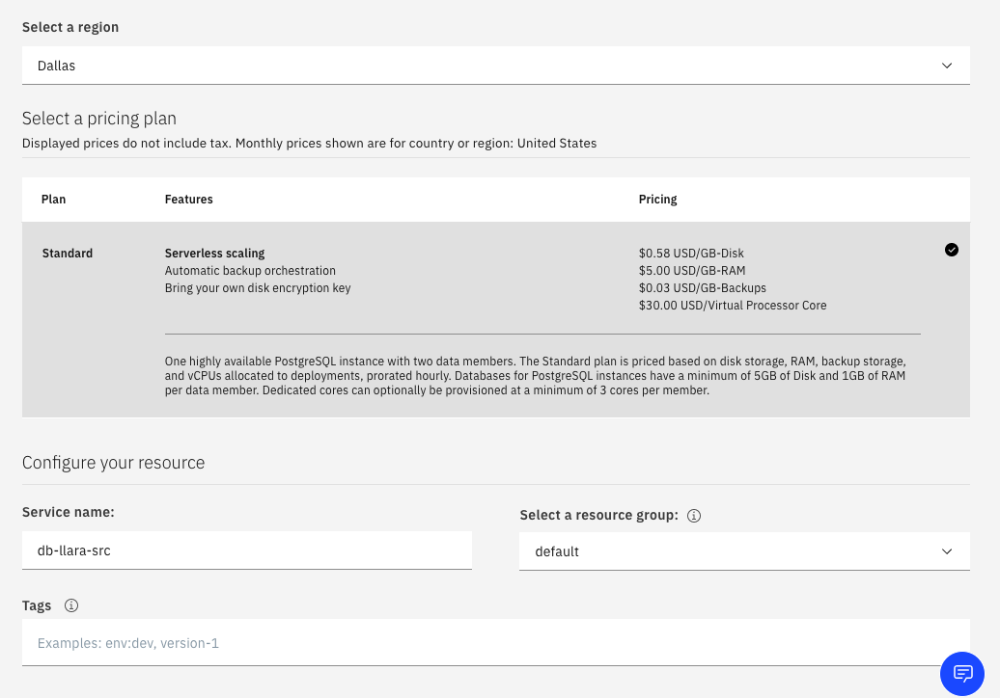
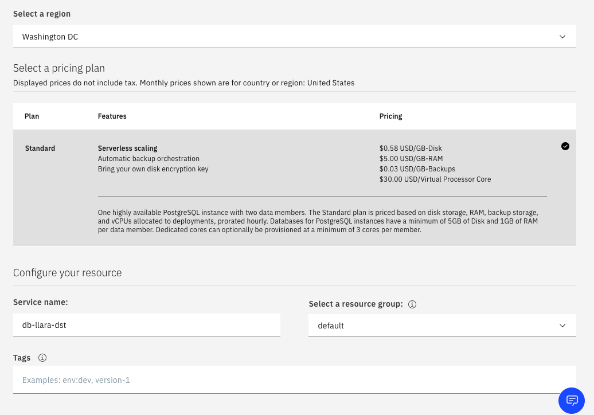
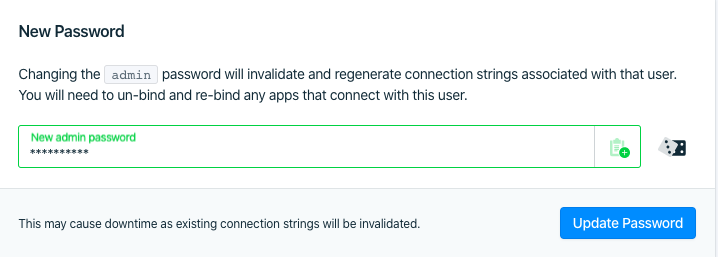
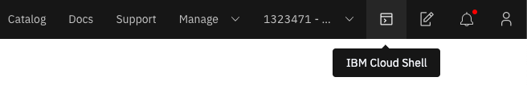

# Replicación de Datos en Database for PostgreSQL


## Componentes Incluidos
* [Database for PostgreSQL](https://cloud.ibm.com/catalog/services/databases-for-postgresql): Database for PostgreSQL es una Base de Datos como Servicio (DBaaS) administrada por IBM Cloud basada en el proyecto Open Source [PostgreSQL](https://www.postgresql.org/). Este servicio incluye funcionalidades como alta disponibilidad, backups automaticos y escalamiento desacoplado entre RAM y vCPU. Este servicio cumple con los estandares HIPAA, SOC1 tipo 1 y SOC2 tipo 1.

# Prerequisitos

* Cuenta activa de [IBM Cloud](https://cloud.ibm.com) en modalidad Pay-as-you-go o con suscripción.

# Paso a Paso
IBM Cloud Database for PostgreSQL soporta la [replicación logica](https://www.postgresql.org/docs/current/logical-replication.html) entre bases de datos desde la version 10. El origen se puede configurar como _Publicador_ y el destino se configura como _Suscriptor_. 

### 1. Crear los servicios en IBM Cloud

* Crea un servicio [Database for PostgreSQL](https://cloud.ibm.com/catalog/services/databases-for-postgresql) en la region *Dallas* en el plan _Standard_ como nuestra base de datos origen.

> En el campo _Endpoint_ configura **Both public & private network** para utilizar conexiones por red publica y por la red privada de IBM Cloud.



* Crea un servicio [Database for PostgreSQL](https://cloud.ibm.com/catalog/services/databases-for-postgresql) en la region **Washington DC** en el plan _Standard_ como nuestra base de datos destino.

> En el campo _Endpoint_ vamos a configurar **Both public & private network** para utilizar conexiones por red publica y por la red privada de IBM Cloud.




### 2. Configurar la base de datos origen

* Abre tu servicio de Database for PostgreSQL de Origen cuando termine de aprovisionar.
* En la pestaña _Overview_ copia los valores para el _Private Enpoint_ de **Hostname** y **Port** en un bloc de notas. Los necesitaremos mas adelante.
* En la pestaña _Settings_ actualiza la contraseña del usuario `admin`.



* Abre la terminal de IBM Cloud.

> [IBM Cloud Shell](https://cloud.ibm.com/docs/cloud-shell?topic=cloud-shell-getting-started) es una funcionalidad _beta_ de IBM Cloud. Para su mejor funcionamiento se recomiendan los siguientes [exploradores](https://cloud.ibm.com/docs/overview?topic=overview-prereqs-platform#browsers-platform).




> Si deseas realizar el taller desde la terminal de tu computador debes instalar los siguientes CLI: [IBM Cloud](https://github.com/IBM-Cloud/ibm-cloud-cli-release/releases/), [PSQL](https://www.postgresql.org/download/) y [IBM Cloud DB Plugin](https://cloud.ibm.com/docs/databases-cli-plugin?topic=cloud-databases-cli-cdb-reference#installing-the-cloud-databases-cli-plug-in)

* Configura el origen para que use la replicación logica. Los parametros `max_replication_slots`, y `max_wal_senders` ambos necesitan ajustarse a un valor mayor que 20, ya que PostgreSQL reserva 20 para operaciones futuras.

```
ibmcloud cdb deployment-configuration <nombre-db-origen> '{"configuration":{"wal_level":"logical","max_replication_slots":21,"max_wal_senders":21}}'
```

* Actualiza la contraseña del usuario `repl` ya que es el unico que tiene permisos de replicación.

```
ibmcloud cdb deployment-user-password <nombre-db-origen> repl <nuevaclave>
```

* Conéctate a la base de datos origen. Si no se especifica el usuario por defecto se conecta con `admin`

```
ibmcloud cdb cxn <nombre-db-origen> -s
```

* Crea una base de datos para las estructuras que vamos a replicar.

```
CREATE DATABASE myapp;
```

* Usa el comando `\c myapp` para comenzar a usar la base de datos.
* Crea la siguiente tabla

```
CREATE TABLE films (
    code        char(5) CONSTRAINT firstkey PRIMARY KEY,
    title       varchar(40) NOT NULL,
    did         integer NOT NULL,
    date_prod   date,
    kind        varchar(10),
    len         interval hour to minute
);
```

* Crea un canal de publicación.

```
CREATE PUBLICATION my_publication;
```

* Agrega la tabla `films` al canal de publicación

```
ALTER PUBLICATION my_publication ADD TABLE films;
```

* Por ultimo debemos darle accesos al usuario `repl` por lo menos de leectura sobre todas las tablas que vamos a replicar.

```
GRANT SELECT ON ALL TABLES IN SCHEMA public TO repl;
```

### 3. Configurar la base de datos destino

* Abre tu servicio de Database for PostgreSQL de Destino en la lista de recurso de IBM Cloud.
* En la pestaña _Settings_ actualiza la contraseña del usuario `admin`.
* Conéctate a la base de datos destino con el usuario `admin`.

```
ibmcloud cdb cxn <nombre-db-destino> -s
```

* Crea la misma base de datos y la misma tabla que en el Origen.

```
CREATE DATABASE myapp;

\c myapp

CREATE TABLE films (
    code        char(5) CONSTRAINT firstkey PRIMARY KEY,
    title       varchar(40) NOT NULL,
    did         integer NOT NULL,
    date_prod   date,
    kind        varchar(10),
    len         interval hour to minute
);
```

* Crea una suscripción al canal de origen. Utiliza los valores de **Hostname** y **Port** de la base de datos de origen, asi como la contraseña de usuario `repl`.

```
SELECT create_subscription('subs1','<hostname-origen>','<port-origen>','<password-repl>','repl','myapp','my_publication');
```

### 4. Probando la replicación.

Para probar la replicación basta con que hagamos una inserción en la tabla `films` en la base de datos de origen.

* Ve a la pestaña de la _Session 1_ donde esta la conexión a la base de datos de origen.

* Inserta un valor a la tabla `films`.

```
INSERT INTO films VALUES('UA502', 'Bananas', 105, '1971-07-13', 'Comedy', '82 minutes');
```

* Ve a la pestaña de la _Session 2_ donde esta la conexión a la base de datos de destino.

* Has una consulta sobre la tabla `films`.

```
SELECT * FROM films;
```

* Usa el comando `\q` para cerrar la sesión.

# Conclusiones

El uso de la replicación permite crear esquemas de disponibilidad superior para las aplicaciones desplegadas en la nube. Para un servicio como IBM Cloud Database for PostgreSQL, que ofrece una disponibilidad del 99.99%, tener un replica en una zona distinta ya sea atraves de una [replica solo-lectura](https://cloud.ibm.com/docs/databases-for-postgresql?topic=databases-for-postgresql-read-only-replicas) o una replica activa logica podria incrementar la disponibilidad, con una propabilidad de que ambos fallen del 0.000001%.

